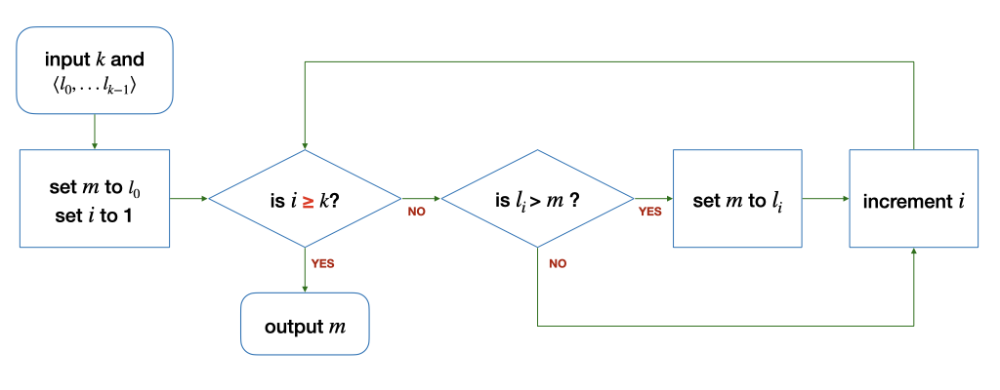
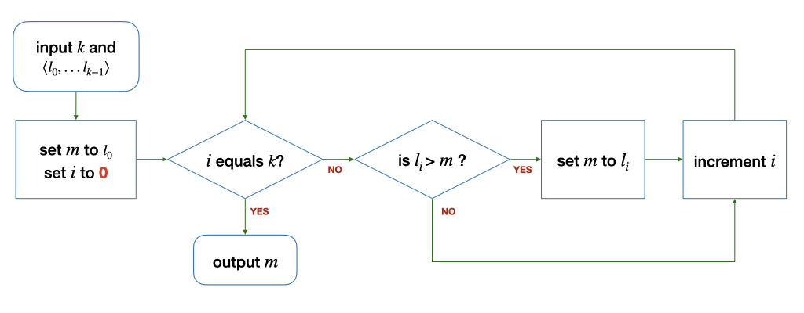
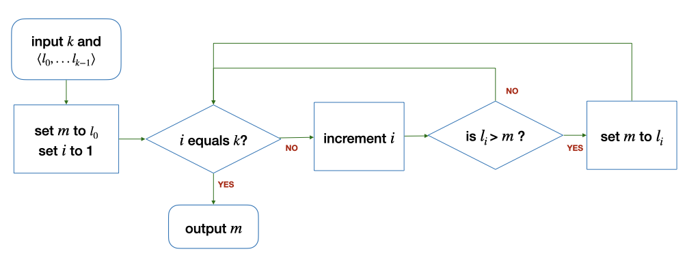
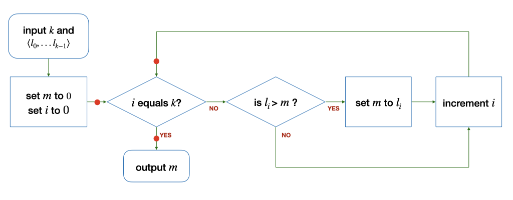

---
search:
  exclude: true
---

# Problem Set

### Problem 2.1 

The following algorithms are slight variations of the one in the notes above.  The differences are highlighted in red.  Do they correctly find the maximum integer from a finite list of $k$ integers ($k > 0$)?  

If an algorithm is buggy, give a counter-example where the output is incorrect.  In addition, give an example input where the algorithm still produces the correct output, where possible.  

(a) 


(b) 


(c) 


(d) 


(e) 


### Problem 2.2

Change the algorithm above to find the minimum value instead of the maximum value from the given list $L = \langle l_0, ..., l_{k-1}\rangle$. You can also assume that the list $L$ is finite and $k > 0$ for this question.

### Problem 2.3

Draw the flowchart for an algorithm, that takes in a list of integers $L = \langle l_0, ..., l_{k-1}\rangle, k > 0$, and computes the _sum_ of all the integers.  Think about what variable(s) do you need.


### Problem 3.1: Getting MAD

The mean absolute deviation, or MAD, of a set of integers measures how spread out a set of data is.  The _absolute deviation_ is the absolute difference between an element in the list with the mean of values of the list.  The mean absolute deviation is the mean of all the absolute differences.  In other words, given $L = \{l_0, ... l_{k-1}\}$, the MAD of $L$ is:

$$\frac{\sum_{i=0}^{k-1} |l_i - \mu|}{k}$$

How do you find MAD by composing various functions we have seen?  Do you need a new function?

### Problem 3.2: Ownself calls ownself

(a) Give an algorithm for finding the sum of all the integers in the list $L$ with $k$ ($k > 0$) integers that is recursive.

(b) The function $pow(i, j)$ computes $i^j$.  Give an algorithm to compute $pow(i, j)$ recursively.

[^1]: In software engineering, there is a name for this principle: DRY, which stands for don't repeat yourself.

### Problem 5.1

In the following valid in C?  Try to compile the program and see if you encounter any compilation error.  What can you infer about what is allowed or not allowed in C?  What could go wrong even if C allows?

(a)
```C hl_lines="14"
#include <math.h>
long square(long x)
{
  return x * x;
}

double hypotenuse_of(long base, long height)
{
  return sqrt(square(base) + square(height));
}

int main()
{
  hypotenuse_of(3.0, 4.0); // <- use 3.0 and 4.0 instead of int.
}
```

(b)
```C hl_lines="14"
#include <math.h>
long square(long x)
{
  return x * x;
}

double hypotenuse_of(long base, long height)
{
  return sqrt(square(base) + square(height));
}

int main()
{
  long h = hypotenuse_of(3, 4); // <-- assign to a long variable
}
```

(c)
```C hl_lines="14"
#include <math.h>
long square(long x)
{
  return x * x;
}

double hypotenuse_of(long base, long height)
{
  return sqrt(square(base) + square(height));
}

int main()
{
  Hypotenuse_Of(3, 4); // <-- use a different case
}
```

(d)
```C hl_lines="9"
#include <math.h>
long square(long x)
{
  return x * x;
}

double hypotenuse_of(long base, long height)
{
  long base; // <-- declare a new base
  return sqrt(square(base) + square(height));
}

int main()
{
  hypotenuse_of(3, 4);
}
```

(e)
```C hl_lines="4"
#include <math.h>
long square(long x)
{
  long sqr = x * x; // <-- declare and assign in one go
  return sqr;
}

double hypotenuse_of(long base, long height)
{
  return sqrt(square(base) + square(height));
}

int main()
{
  hypotenuse_of(3, 4);
}
```

(f)
```C hl_lines="3 6"
#include <math.h>

long sqr;  // <-- use global variable
long square(long x)
{
  sqr = x * x;
  return sqr;
}

double hypotenuse_of(long base, long height)
{
  return sqrt(square(base) + square(height));
}

int main()
{
  hypotenuse_of(3, 4);
}
```


(g)
```C hl_lines="5 6 7 8 9 10 11 12 13"
#include <math.h>

int main()
{
  long square(long x) // <-- define function within function.
  {
	return x * x;
  }

  double hypotenuse_of(long base, long height) // <--
  {
    return sqrt(square(base) + square(height));
  }

  hypotenuse_of(3, 4);
}
```

### Problem 8.1

Draw the flowcharts for the two code snippets below.  Identify redundant comparisons (if any), in each of the snippets.

(a)
```C
if (x > y) {
  max = x;
} else if (x < y) {
  max = y;
} else if (x == y) {
  max = y;
}
```

(b)
```C
if (x > y) {
  max = x;
} else {
  max = y;
}
```

### Problem 8.2

Suppose we break down the table below in a slightly different way.

| Score                       | Letter Grade |
| --------------------------- | ------------ |
| 8 or higher                 | A            |
| Less than 8 but 5 or higher | B            |
| Less than 5 but 3 or higher | C            |
| Less than 3                 | D            |

We rewrite the tables into three smaller tables, as follows:

| Score       | Letter Grade |
| ----------- | ------------ |
| 5 or higher | See Table X  |
| Less than 5 | See Table Y  |

where Table X (5 or higher) is

| Score       | Letter Grade |
| ----------- | ------------ |
| 8 or higher | A            |
| Less than 8 | B            |

and Table Y (less than 5) is

| Score       | Letter Grade |
| ----------- | ------------ |
| 3 or higher | C            |
| Less than 3 | D            |

Write the corresponding `if`-`else` statements to print out the letter grade based on the tables above.  Draw the corresponding flowchart.

### Problem 9.1

Consider the function below, which aims to return the maximum value given three numbers.

```C
long max_of_three(long a, long b, long c)
{
  long max = 0;
  if ((a > b) && (a > c)) {
    // a is larger than b and c
    max = a;
  }
  if ((b > a) && (b > c)) {
    // b is larger than a and c
    max = b;
  }
  if ((c > a) && (c > b)) {
    // c is larger than a and b
    max = c;
  }
  return max;
}
```

(a) The function is not correct.  Give a sample test value of `a`, `b`, and `c` that would expose the bug.

(b) List all conditions on the inputs `a`, `b`, and `c` such that the function above would fail.

### Problem 9.2

The restaurant WcDonald's is setting a new rule for dining in.  Two people are allowed to dine in only if both of them are fully vaccinated against COVID-19.  A child below 12 years old from the same household is exempted from the rule.

Suppose we represent each diner with a `long` variable, and we have the following functions:

- `bool is_vaccinated(long p)` returns true if and only if `p` is fully vaccinated.
- `bool is_a_child(long p)` returns true if and only if `p` is a child below 12.
- `bool are_from_same_household(long p, long q)` returns true if and only if both `p` and `q` are from the same household.

(a) Add as many rows as needed to the table below to enumerate all conditions under which `p` and `q` can dine in together at WcDonald's.  Each table cell can be `yes`, `no`, or `don't care`.

`is_vaccinated(p)` | `is_vaccinated(q)` | `is_a_child(p)` | `is_a_child(q)` | `are_from_same_household(p,q)` | 
---------|----------|------------|------------|-------------|
yes      | yes      | don't care | don't care |  don't care |
?        | ?        | ?          | ?          |  ?          |

The first row has been filled up for you.  It represents the condition in which both diners are fully vaccinated.  In this case, it does not matter whether they are from the same household or they are children.

(b) Using the table from (a) to help you write a function `can_dine_in(long p, long q)` that returns true if and only if `p` and `q` can dine in together at WcDonald's.

### Problem 10.1

Negate the following logical expression, then apply De Morgan's Law to simplify the resulting expression.  Assume all variable names mentioned are boolean variables.

(a) `(x > 1) && (y != 10)`

(b) `!eating && drinking`

(c) `(has_cs2030 || has_cs2113) && has_cs2040c`

### Problem 10.2

In the code below, replace `???` with the appropriate assertion.  What will be printed?

```C
long score = 4;
if (something) {
  score = 10;
} else {
  score = 0;
}
// { ??? }

if (score == 4) {
    score = 1;
} else {
    score += 10;
}
// { ??? }

if (score >= 10) {
    cs1010_println_string("ok");
} else {
    cs1010_println_string("failed");
}
```

### Problem 11.1

Here is another version of the `factorial` function:

```C
long factorial(long n)
{
    long i = n - 1;
    long product;
    for (product = n; i >= 2; product *= i)
    {
        i -= 1;
    }
    return product;
}
```

Does this code run correctly?  If it is incorrect, explain what is wrong and suggest a fix.  (Hint: translate this to the corresponding flowchart and trace through the flowchart).

### Problem 11.2

Trace the following algorithms:

```C
long mystery(long n, long k) {
    long something = n;
    long count = -1;
    while (something >= 1) {
        something /= k;
        count += 1;
    }
    return count;
}
```

(a)
What is the return value when

- `n` is 8 and `k` is 2?  
- `n` is 81 and `k` is 3?  
- `n` is 100 and `k` is 5?

Answer these questions by reading the code first, instead of trying it out on a computer (you can verify later).

(b)
What is the mathematical expression that our mystery function here is trying to compute based on the examples above?

(c)
Give a pair of inputs that would cause the function to return the wrong answer.

(d)
Give a pair of inputs that would cause the function to loop forever.

### Problem 12.1

(a) Consider the algorithm to find the maximum among a list of integers $L$ with at least one element ($k > 0$) below:


The loop invariant for this loop must hold at the three points marked with the red dots: before the loop, after each iteration of the loop, and after the loop.

State the loop invariant, explain why it holds at the three points above, and threfore argue that the loop above correctly finds the maximum among the elements of the list $L$.  

(b) Now, consider a slightly different algorithm to find the maximum among a list of integers $L$ with at least one element ($k > 0$) below:



Explain why you cannot find a loop invariant similar to Part (a) above, and therefore show that the algorithm does not correctly find the maximum in certain cases.


### Problem 13.1

Trace through what gets stored in the call stack when we run the following programs:

```C
#include <math.h>

long square(long x)
{
  return x*x;
}

double hypotenuse_of(long base, long height)
{
  return sqrt(square(base) + square(height));
}

int main()
{
  hypotenuse_of(3, 4);
}
```

### Problem 13.2

Trace through what gets stored in the call stack when we run the following programs:

```C
#include "cs1010.h"

long factorial(long n)
{
  if (n == 0) {
    return 1;
  }
  return factorial(n-1) * n;
}

int main()
{
  factorial(3);
}
```

### Problem 14.1

Consider the snippet below.

```C
void doThat(long a[], long b[]) {
  a[0] = 100;
  b[1] = 200;
  // Line A
}

void doThis(long a[]) {
  long *b = a;  
  doThat(a, b);
}

int main()
{
  long a[3] = {0, 0, 0};
  doThis(a);
  // Line B
}
```

a. Show the content of the stack at Line A if the program above is executed.

b. What is the content of array `a` at Line B?

### Problem 14.2

Consider the snippet below.

```C
void doThat(long list[]) {
  list[1] = 200;
  // Line A
}

void doThis(const long a[]) {
  long b[2] = {10, 10};
  a = b;
  doThat(a);
}

int main()
{
  long a[3] = {0, 0, 0};
  doThis(a);
  // Line B
}
```

a. Does the code compile cleanly?

b. Show the content of the stack at Line A if the program above is executed.

c. What is the content of array `a` at Line B?

### Problem 15.1

Sketch the content of the memory while tracing through the following code.  What would be printed?

```C
long *ptr1;
long *ptr2;
long x;
long y;

ptr1 = &x;
ptr2 = &y;

*ptr1 = 123;
*ptr2 = -1;

cs1010_println_long(x);
cs1010_println_long(y);
cs1010_println_long(*ptr1);
cs1010_println_long(*ptr2);

ptr1 = ptr2;
*ptr1 = 1946;

cs1010_println_long(x);
cs1010_println_long(y);
cs1010_println_long(*ptr1);
cs1010_println_long(*ptr2);

y = 10;

cs1010_println_long(x);
cs1010_println_long(y);
cs1010_println_long(*ptr1);
cs1010_println_long(*ptr2);
```

### Problem 15.2

What is wrong with both programs below?

```C
double *addr_of(double x)
{
  return &x;
}

int main()
{
  double c = 0.0;
  double *ptr;

  ptr = addr_of(c);
  *ptr = 10;
}
```


```C
double *triple_of(double x)
{
  double triple = 3 * x;
  return &triple;
}

int main()
{
  double *ptr;

  ptr = triple_of(10);
  cs1010_println_double(*ptr);
}
```

### Problem 16.1

Consider the program below:
```C
void foo(double *ptr, double trouble) {
  ptr = &trouble;
  *ptr = 10.0;
}

int main() {
  double *ptr;
  double x = -3.0;
  double y = 7.0;
  ptr = &y;

  foo(ptr, x);

  cs1010_println_double(x);
  cs1010_println_double(y);
}
```

What would be printed?

### Problem Set 17.1

Draw the call stack and the heap, showing what happened when we run the following code:

```C
void foo(long *y, long *z)
{
  y[0] = -7;
  y[1] = -8;
  z[0] = 4;
  z[1] = 5;
}


int main()
{  
  long y[2] = {1, 2};
  long *z = calloc(2, sizeof(long));

  z[0] = y[0];
  z[1] = y[1];

  foo(y, z);
}
```

### Problem 20.1

Order the following functions in the increasing order of rate of growth:

- $n!$,
- $2^n$,
- $\log_{10} n$,
- $\ln n$,
- $n^4$,
- $n\ln n$,
- $n$,
- $n^2$,
- $e^n$,
- $\sqrt{n}$

### Problem 20.2

What is the Big-O running time of the following code, in terms of $n$?

a)

```C
for (long i = 0; i < n; i += 1) {
  for (long j = 0; j < n; j += 2) {
    cs1010_println_long(i + j);
  }
}
```

b)
```C
for (long i = 1; i < n; i *= 2) {
  for (long j = 1; j < n; j *= 2) {
    cs1010_println_long(i + j);
  }
}
```

c)
```C
for (long j = 0; j < n; j += 1) {
  for (long i = 0; i < j; i += 1) {
    cs1010_println_long(i + j);
  }
}
```

d)
```C
long k = 1;
for (long j = 0; j < n; j += 1) {
  k *= 2;
  for (long i = 0; i < k; i += 1) {
    cs1010_println_long(i + j);
  }
}
```

### Problem 20.3

a)
Express the running time of the following function as a recurrence relation:

```C
void foo(long n) {
  if (n == 1) {
    return 1;
  }
  return foo(n/2) + 2;
}
```

What is its running time?

b)
Express the running time of the following function as a recurrence relation:

```C
void foo(long n) {
  if (n == 1) {
    return 1;
  }
  for (long i = 0; i < n; i += 1) {
    cs1010_println_long(i);
  }
  return foo(n - 1);
}
```

What is its running time?


### Problem 21.1

Re-write the binary search algorithm using a loop.

### Problem 21.2

Instead of returning -1 if the query `q` is not found, modify the binary search algorithm in Problem 21.1 such that it returns either:

- a position `k`, such as `a[k] <= q <= a[k+1]`. 
- `-1` if `q < a[0]` 
- `n-1` if `q > a[n-1]`

### Problem 22.1

In the implementation of bubble sort above, we always make $n-1$ passes through the array.  It is, however, possible to stop the whole sorting procedure, when a pass through the array does not lead to any swapping.  Modify the code above to achieve this optimization.

### Problem 22.2

(a) Suppose the input list to insertion sort is already sorted.  What is the running time of insertion sort?

(b) Suppose the input list to insertion sort is inversely sorted.  What is the running time of insertion sort?

### Problem 22.3

In certain scenarios, a comparison is more expensive than an assignment.  For instance, comparing two strings is more expensive than assigning a string to a variable.  In this case, we can reduce the number of comparisons during insertion sort by doing the following:

repeat

- take the first element X from the unsorted partition
- use binary search to find the correct position to insert X
- insert X into the right place

until the unsorted partition is empty.

Implement the variation to the insertion sort algorithm above.  You may use your solution from Problem 21.1.


### Problem 23.1

Suppose that we add a new restriction to the Tower of Hanoi puzzle.  Let's say that the disks are on Peg A, to begin with, and we want to move the disk to Peg C.  We are only allowed to move a disk either to Peg B from another peg or from Peg B to another peg.  In other words, we cannot move the disks between Peg A and Peg C directly.

Change the recursive algorithm above to solve the Tower of Hanoi with this new restriction.  How many steps (use big O notation) are needed now?

### Problem Set 24.1

In the code above, we assume that the string contains distinct characters.  If there are duplicate characters in the string, duplicate permutations will be generated.  For instance, if the input is `aaa`, the code above would print `aaa` six times.

We can fix this by making a small change to the function `permute` above so that it does not generate duplicate permutations.  This can be done by adding a condition (Line A).  Write a boolean function that we can call in Line A to check if we should continue to permute the rest of the string, and therefore avoid generating duplicate permutations when the input string contains duplicate characters.

```C
void permute(char a[], size_t len, size_t curr) {
  if (curr == len-1) {
    cs1010_println_string(a);
    return;
  }

  permute(a, len, curr + 1);
  for (size_t i = curr + 1; i < len; i += 1) {
    if (...) { // Line A
      swap(a, curr, i);
      permute(a, len, curr + 1);
      swap(a, i, curr);
    }
  }
}
```

### Problem 25.1

In the code with pruning above, we check if the queens placed on Rows 0 to `row` threaten each other, and call `nqueens` recursively only if these queens do not threaten each other.  Identify the repetitive work being done in the calls `threaten_each_other_diagonally`, and suggest a way to remove the repetitive work.

### Problem 25.2

Consider the code to generate all possible permutations of a string from Problem 24.1.  Suppose that we restrict the permutations to those where the same character does not appear next to each other.  Modify the solution to Problem 24.1 to prune away permutations where the same character appears more than once consecutively.

